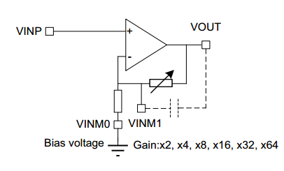

# STM32G431 Pin map

| Group                 | Designation          | Pin  | Peripheral           | Alternate function | Notes                                                        |
| --------------------- | -------------------- | ---- | -------------------- | ------------------ | ------------------------------------------------------------ |
| **Motor output**      | PWM CH1              | PA8  | TIM1_CH1             | AF6                | L6387ED controls output MOSFETs                              |
|                       | PWM CH1N             | PC13 | TIM1_CH1N            | AF4                |                                                              |
|                       | PWM CH2              | PA9  | TIM1_CH2             | AF6                |                                                              |
|                       | PWM CH2N             | PA12 | TIM1_CH2N            | AF6                |                                                              |
|                       | PWM CH3              | PA10 | TIM1_CH3             | AF6                |                                                              |
|                       | PWM CH3N             | PB15 | TIM1_CH3N            | AF4                |                                                              |
|                       |                      |      |                      |                    |                                                              |
| **Current sense**     | Current 1+           | PA1  | OPAMP1_VINP          |                    | Current sense relies on the built-in Op-Amp within the STM32G431. + pin is connected to the sense resistor through a biasing resistor network which changes the DC offset. |
|                       | Current 1-           | PA3  | OPAMP1_VINM          |                    | The - pin is connected to the other side of the sense resistor which is connected to GND |
|                       | Current 1 out        | PA2  | OPAMP1_VOUT          |                    | Op-amp output. Connects to ADC1_IN3 or ADC1_IN13             |
|                       | Current 2+           | PA7  | OPAMP2_VINP          |                    |                                                              |
|                       | Current 2-           | PA5  | OPAMP2_VINM          |                    |                                                              |
|                       | Current 2 out        | PA6  | OPAMP2_VOUT          |                    | Op-amp output. Connects to ADC2_IN3 or ADC2_IN16             |
|                       | Current 3+           | PB0  | OPAMP3_VINP          |                    |                                                              |
|                       | Current 3-           | PB2  | OPAMP3_VINM          |                    |                                                              |
|                       | Current 3 out        | PB1  | OPAMP3_VOUT          |                    | Op-amp output. Connects to ADC1_IN12 or ADC2_IN18            |
|                       |                      |      |                      |                    |                                                              |
| **Back EMF sense**    | BEMF1                | PA4  | ADC2_IN17            |                    | For floating MOSFET outputs the Back EMF can be sampled. A voltage divider network can be enabled with the GPIO_BEMF pin. |
|                       | BEMF2                | PC4  | ADC2_IN5             |                    | Back EMF sensing is clamped to 3.3V. Enabling the voltage divider is necessary when the Back EMF is above 3.3V but disabling it will increase the resolution at low speeds (small Back EMF) |
|                       | BEMF3                | PB11 | ADC1/2_IN14          |                    | The voltage divider has Rtop=10k and Rbottom=2.2k but also includes a Schottky diode in series with the bottom resistor with a forward voltage of 250-300 mV. |
|                       | GPIO_BEMF            | PB5  |                      |                    | When GPIO_BEMF is HIGH Vbemf is sensed directly. When GPIO_BEMF is LOW the sensed voltage is defined by = (2.2k/(2.2k+10k)) * (Vbemf - Vf) + Vf |
|                       |                      |      |                      |                    |                                                              |
| **Voltage sense**     | VBUS (input) sense   | PA0  | ADC2_IN1             |                    | Voltage divider network with Rtop=169k / Rbottom=18k and clamp to 3.3V |
| **Temperature sense** | Temperature feedback | PB14 | ADC1_IN5             |                    | Voltage divider network with Rtop=10k NTC  / Rbottom=4.7k with a 10nF capacitor in parallel for low-pass filtering |
|                       |                      |      |                      |                    |                                                              |
| **Encoder**           | A+/H1                | PB6  | TIM4_CH1             | AF2                | Encoder/Hall effect sensor inputs supporting 5V, with input clamps to 3.3V and a low pass filter at 8.8 MHz cutoff |
|                       | B+/H2                | PB7  | TIM4_CH2             | AF2                |                                                              |
|                       | Z+/H3                | PB8  | TIM4_CH3             | AF2                |                                                              |
|                       |                      |      |                      |                    |                                                              |
| **Communication**     | USART2_TX            | PB3  | USART2_TX            | AF7                |                                                              |
|                       | USART2_RX            | PB4  | USART2_RX            | AF7                |                                                              |
|                       | CAN_TX               | PB9  | FDCAN1_TX            | AF9                |                                                              |
|                       | CAN_RX               | PA11 | FDCAN1_RX            | AF9                |                                                              |
|                       | CAN_TERM Enable      | PC14 |                      |                    | Through AS11P2TLRQ                                           |
|                       | CAN_SHUTDOWN         | PC11 |                      |                    | Through TCAN330DCNT                                          |
|                       |                      |      |                      |                    |                                                              |
| **Debug**             | LED                  | PC6  | TIM3_CH1 or TIM8_CH1 |                    |                                                              |
|                       | BUTTON               | PC10 |                      |                    |                                                              |
|                       | PWM IN               | PA15 | TIM2_CH1 or TIM8_CH1 |                    |                                                              |
|                       | POTENTIOMETER        | PB12 | ADC1_IN11            |                    |                                                              |

# Op-Amp configuration

The shunt resistor has been changed from the stock 3 mOhm, 3W to a [15 mOhm, 3W in 2512 packaging](https://www.mouser.com/ProductDetail/bourns/cra2512-fz-r015elf)

Futhermore the internal Op-amp of the STM32G431 device is used to achieve the configuration by configuring it into non-inverting PGA mode with PGA gain of 16 (equivalent to the non-inverting gain achieved by the R4 and R5 resistors)

